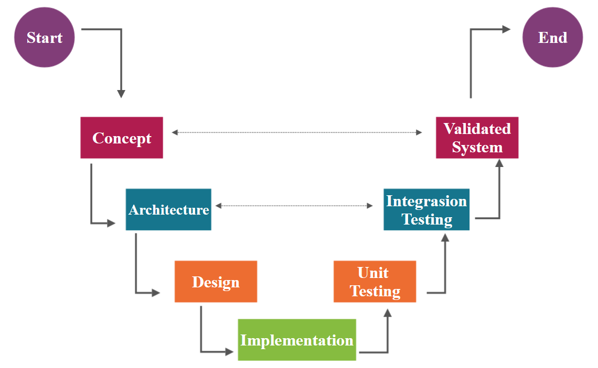

##Content

1. [Introduction](#Introduction)
2. [Subject](#Subject)
3. [Objective/goal](#Objective/goal)
4. [Framework](#Framework)
5. [Telegram bot](#Telegram bot)
6. [Developing a skeleton](#Developing a skeleton)
7. [Chapter 1 Chatbot conversation using a finite state machine](#Chapter 1 Chatbot conversation using a finite state machine)
    1. [1.1 Finite state machine](#1.1 Finite state machine)
    2. [1.2 Math model](#1.2 Math model)
    3. [1.3 Theory](#1.3 Theory)
    4. [1.4 Implementation](#1.4 Implementation)
8. [Chapter 2 The difference between Multithreading and Asyncio in Bot development](#Chapter 2 The difference between Multithreading and Asyncio in Bot development)
    1. [2.1 Asynchronous](#2.1 Asynchronous)
    2. [2.2 Multithreading](#2.2 Multithreading)
    3. [2.3 Async vs thread](#2.3 Async vs thread)
    4. [2.4 Conclusion](#2.4 Conclusion)
9. [Chapter 3 Scanning documents by using OpenCV’s CNN method](#Chapter 3 Scanning documents by using OpenCV’s CNN method)
    1. [3.1 OpenCV](#3.1 OpenCV)
    2. [3.2 CNN Network Architecture](#3.2 CNN Network Architecture)
        1. [3.2.1 Convolutional layer](#3.2.1 Convolutional layer)
        2. [3.2.2 Pooling](#3.2.2 Pooling)
        3. [3.2.3 Fully connected neural network](#3.2.3 Fully connected neural network)
        4. [3.2.4 Training](#3.2.4 Training)
    3. [3.3 Scanning documents algorithm](#3.3 Scanning documents algorithm)
    4. [3.4 Implementation](#3.4 Implementation)
10. [Chapter 4 Pomodoro timer](#Chapter 4 Pomodoro timer)
    1. [4.1 Context](#4.1 Context)
    2. [4.2 Goals of the Pomodoro timer](#4.2 Goals of the Pomodoro timer)
    3. [4.3 Assumptions Fundamentals of the Pomodoro technique](#4.3 Assumptions Fundamentals of the Pomodoro technique)
    4. [4.4 Pomodoro timer’s algorithm](#4.4 Pomodoro timer’s algorithm)
    5. [4.5 Implementation](#4.5 Implementation)
11. [Chapter 5 Reminder](#Chapter 5 Reminder)
    1. [5.1 Context](#5.1 Context)
    2. [5.2 Reminder’s algorithm](#5.2 Reminder’s algorithm)
        1. [5.2.1 SimpleCalendar](#5.2.1 SimpleCalendar)
        2. [5.2.2 Timepicker](#5.2.2 Timepicker)
12. [Bibliography](#Bibliography)

###Introduction

A chatbot is a program that finds out the needs of users and then helps meet them. Automatic communication with the user is carried out using text or voice. The chatbot communicates on behalf of the company or brand to simplify online communication (to provide up-to-date information in the most expeditious time), it is used as an alternative to correspondence with a live operator or a call to the company manager.

###Subject

This chatbot is designed to perform many small tasks that will help minimize time and increase efficiency at work or school.
	
Most of the working hour is spent in finding answers, locating files, doing research, scheduling meetings, coordinating with colleagues, and other ordinary tasks. Multi-tool chatbot will help focus on what matters for achieving goals and improving job satisfaction.

###Objective/goal

In this project, it is planned to add features such as reminders, schedule organizer, timer, Scan document and convert them to pdf to increase productivity that will help society make their work more comfortable and productive.

Projects with a similar goal:
- Zoom.ai - an automated virtual assistant that can handle meeting scheduling, research, introductions, reminders, travel, and more.
- Jarvis - bot for FB Messenger to remind to get stuff done.
- Me - reminder assistant.
- Xeet - xeet organizes all group events automatically by inviting, reminding, and keeping up to date with all group members.

###Framework

Common approach is to use a V-model to verify that software meets the requirements. the left branch of the V-model begins with system-level requirements, which leads to architecture and design. The tip of the V-model is the implementation phase to convert the design into code implementation. The right branch represents the testing of the System, starting with unit tests in code to integration tests of different subsystems.

###Telegram bot

Telegram uses MTProto encryption protocol. The MTProto API (aka Telegram API) is the API through which the Telegram application communicates with the server. The Telegram API is fully open, so any developer can write their messenger client. To write bots, the Telegram Bot API was created — an add-on to the Telegram API.

To use the Bot API, you don't need to know anything about how the MTProto encryption protocol works — our auxiliary server will handle all the encryption and communication with the Telegram API itself. There is a connection to the server via a simple HTTPS interface, which provides a simple version of the Telegram API.

Among the simplifications of the Bot API:

- working through webhooks,
- simplified message markup.

The bot must also be able to send requests to the Telegram server and receive updates from it. To get updates in one of two ways:

- Polling — just send a regular request to the Telegram server for updates,
- Webhook — make sure that Telegram itself sends requests to the desired URL.

Creating a bot is done through a special bot [@BotFather](https://telegram.me/BotFather). When the bot was created, BotFather will give the token

When the user launches the bot for the first time with the start command, he sees the "Start" button. By clicking on this button, the /start command is sent. Each Telegram user, bot, group, or channel has its unique ID.

The bot can't get old messages from the chat. The bot can't get a list of all its users. All the bot can get is information about updates. This is the main difficulty of developing bots. It is possible to get information about new messages in the bot and other events, but only once.

###Developing a skeleton

To develop the "skeleton" of the bot, you need to import the necessary aiogram library modules and the bot token, as well as initialize the bot and dispatcher objects:

    from aiogram import Bot, Dispatcher, executor, types
    #Configure_logging
    logging.basicConfig(level=logging.INFO)
    
    #Initialize_bot_and_dispatcher
    bot=Bot(token=API_TOKEN)
    dp = Dispatcher(bot)
    
The command that starts the user's communication with the bot - /start. Therefore, it is necessary for the bot to respond to this command. Creating a message_handler and declaring a response function there:

    #Introduce_Start
    @dp.message_handler(commands=['start'])
    async def send_welcome(message: types.Message):
    """
    This handler will be called when user sends `/start` or `/help` command
    """
    await message.answer("Hi{user}!\nI'm @HandyMultiTBot!\n"
    .format(user=message.from_user.full_name))
    
Сreate a handler for the /help command - so that the user knows the capabilities of the bot. to do this, a separate message_handler is created for this command:

     Introduce help
    @dp.message_handler(commands=['help'])
    async def process_help_command(message: types.Message):
        msg = text(bold('I can handle this commands:'),
                   '/Scan' '\n/timer', sep='\n')
        await message.answer(msg, parse_mode=ParseMode.MARKDOWN)

If you do not specify the type of message to process, the library only processes text messages by default. In this case, on the last line, a message is sent to the user not by a response, but by a simple message. To do this, I used the answer method and passed two parameters to it - the message text and its style.

I used polling to receive messages from Telegram servers, which is a continuous poll of the server for fresh updates.

    if __name__ == '__main__':
        executor.start_polling(dp, skip_updates=True)
        
##Chapter 1. Chatbot conversation using a finite state machine

###1.1 Finite state machine
A finite-state machine (FSM), sometimes known as a finite automaton or a state machine, is a mathematical model of computing. It's an abstract machine that can only be in one of a finite set of states at any one moment. In response to some inputs, the FSM can transition from one state to another; this transition is referred to as a transition. An FSM is defined by a set of states, a starting state, and the inputs that cause each transition. There are two kinds of finite-state machines: deterministic finite-state machines and non-deterministic finite-state machines. A deterministic finite-state machine can be built in the same way as a non-deterministic one.

The behavior of state machines may be observed in many modern gadgets that conduct a preset sequence of activities based on a sequence of events supplied to them. Vending machines, which dispense products when the correct combination of coins is deposited, elevators, whose sequence of stops is determined by the floors requested by riders, traffic lights, which change sequence when cars are waiting, and combination locks, which require the input of a sequence of numbers in the correct order, are simple examples.

The finite-state machine has less computing capacity than other computation models. This is due to the fact that the amount of states in an FSM limits its memory. A finite-state machine has the same computing capability as a Turing computer, but its head can only execute "read" operations and must always travel from left to right. FSMs are investigated in the broader subject of automata theory.

In automata theory, an automaton is a machine that reacts to inputs and creates outputs. In that context, the phrases input and output are often used to alphabetic symbols. Inputs and outputs in modern state machines are defined in more detail. Inputs can be events such as a button click or a timer, whereas outputs can be actions such as an operation call or a variable assignment.

###1.2 Math model

The following formal meanings are found in line with the general classification. A quintuple (Σ, S, sₒ, ẟ, F) is a deterministic finite-state machine or deterministic finite-state acceptor.

- Σ is the input alphabet
- S is a finite non-empty set of states
- sₒ is an initial state, an element of S
- ẟ is the state-transition function: ẟ : S x Σ →S
- F is the set of final states, a subset of S

It is common to allow to be a partial function in both deterministic and non-deterministic FSMs, i.e. ( s, x ) does not have to be specified for every combination of  and . M will announce an error if an FSM M is in state s, the next symbol is x, and ( s, x ) is not specified. This is useful for defining general state machines, but not so much for transforming them. In their most basic form, some algorithms can necessitate complete functions.

###1.3 Theory
The dialog system is the most significant function of bots. Unfortunately, not all of the bot's activities can be accomplished with a single message or order. Let's pretend there's a dating bot where you have to register with your name, age, and a picture of your face. We may, of course, request that the user submit a picture with all of the data specified in the caption, but this is cumbersome for processing and re-entry.

Consider a step-by-step data entry process in which the bot "turns on" the waiting mode for specific information from a specific user at the start, then checks the entered data at each point, and then stops waiting for the next step and returns to the main mode with the command [/cancel]()

The green arrows represent the process of going through the steps without mistakes, the blue arrows represent saving the current state and waiting for re-entry, and the red arrows represent exiting the whole process due to the /cancel command or some other command that means cancellation.

Building a conversational interface in the form of a finite automaton would save a lot of time and effort because you just have to deal with the current phase in the conversation at any given time. The ability to build functional conversational interfaces is what makes FSM so appealing.

###1.4 Implementation
The initial stage is to establish a state. The built-in StatesGroup class I preferred. Creating a state appears to be as follows:

    # States
    class Form(StatesGroup):
        name = State()  # Will be represented in storage as 'Form:name'
        age = State()  # Will be represented in storage as 'Form:age'
        
The zero state begins with the command [/start](). In it, the user progresses from zero to the first state. The bot prompts the user to provide their name in the cmd_start function.

    @dp.message_handler(commands='start')
    async def cmd_start(message: types.Message):
        """
        Conversation's entry point
        """
        # Set state
        await Form.name.set()
    
        await message.reply("Hi there! What's your name?")

If the user wishes to leave the no matter state, they can use the [/cancel]() command to remove the bot mode from the finite-state machine.

     You can use state '*' if you need to handle all states
    @dp.message_handler(state='*', commands='cancel')
    @dp.message_handler(Text(equals='cancel', ignore_case=True), state='*')
    async def cancel_handler(message: types.Message, state: FSMContext):
        """
        Allow user to cancel any action
        """
        current_state = await state.get_state()
        if current_state is None:
            return
        logging.info('Cancelling state %r', current_state)
        # Cancel state and inform user about it
        await state.finish()
        # And remove keyboard (just in case)
        await message.reply('Cancelled.', reply_markup=types.ReplyKeyboardRemove())
        
If the variable is appropriately assigned, the bot will proceed to the next function, which will store the variable to the database and provide the user with a new question for the next state transition.

    @dp.message_handler(state=Form.name)
    async def process_name(message: types.Message, state: FSMContext):
        """
        Process user name
        """
        async with state.proxy() as data:
            data['name'] = message.text
        await Form.next()
        await message.reply("How old are you?")

The bot will remain in the current state for each wrong data entry until the user inputs the correct variable or cancels it. In the `process_age_invalid` function, for example, the bot asks the user how old he is when inputting characters, and it will continue to question the user until he provides a number.

    # Check age. Age gotta be digit
    @dp.message_handler(lambda message: not message.text.isdigit(), state=Form.age)
    async def process_age_invalid(message: types.Message):
        """
        If age is invalid
        """
        return await message.reply("Age gotta be a number.\nHow old are you? (digits only)")

Finally, when the user assigns the Form.age variable, the next state is triggered. The bot will invoke the `process_finish` function, which will save the Form.age and deliver a welcome message including the previously entered values. When the bot no longer requires variables, it exits this mode (FSM) `state.finish()`.

    @dp.message_handler(state=Form.age)
    async def process_finish(message: types.Message, state: FSMContext):
             # Update state and data
             await Form.next()
             await state.update_data(age=int(message.text))
            # send message
            await bot.send_message(
                message.chat.id,
                md.text(
                    md.text('Hi! Nice to meet you,', md.bold(data['name'])),
                    md.text('Age:', md.code(data['age'])),
                    sep='\n',
                ),
                reply_markup=markup,
                parse_mode=ParseMode.MARKDOWN,
            )
        # Finish conversation
        await state.finish()
        

