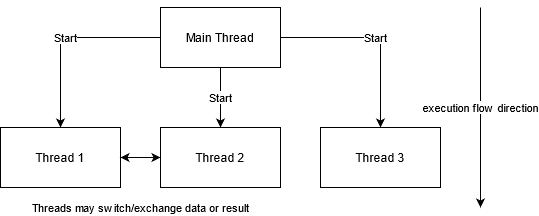
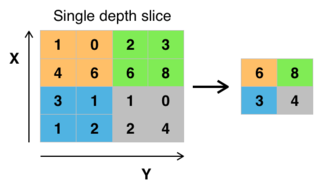

# Content

1. [Introduction](#Introduction)
2. [Subject](#Subject)
3. [Objective/goal](#Objective/goal)
4. [Framework](#Framework)
5. [Telegram bot](#Telegram_bot)
6. [Developing a skeleton](#Developing_a_skeleton)
7. [Chapter 1 Chatbot conversation using a finite state machine](#Chapter_1_Chatbot_conversation_using_a_finite_state_machine)
    1. [1.1 Finite state machine](#1.1_Finite_state_machine)
    2. [1.2 Math model](#1.2_Math_model)
    3. [1.3 Theory](#1.3_Theory)
    4. [1.4 Implementation](#1.4_Implementation)
8. [Chapter 2 The difference between Multithreading and Asyncio in Bot development](#Chapter_2_The_difference_between_Multithreading_and_Asyncio_in_Bot_development)
    1. [2.1 Asynchronous](#2.1_Asynchronous)
    2. [2.2 Multithreading](#2.2_Multithreading)
    3. [2.3 Async vs thread](#2.3_Async_vs_thread)
    4. [2.4 Conclusion](#2.4_Conclusion)
9. [Chapter 3 Scanning documents by using OpenCV’s CNN method](#Chapter_3_Scanning_documents_by_using_OpenCV’s_CNN_method)
    1. [3.1 OpenCV](#3.1_OpenCV)
    2. [3.2 CNN Network Architecture](#3.2_CNN_Network_Architecture)
        1. [3.2.1 Convolutional layer](#3.2.1_Convolutional_layer)
        2. [3.2.2 Pooling](#3.2.2_Pooling)
        3. [3.2.3 Fully connected neural network](#3.2.3_Fully_connected_neural_network)
        4. [3.2.4 Training](#3.2.4_Training)
    3. [3.3 Scanning documents algorithm](#3.3_Scanning_documents_algorithm)
    4. [3.4 Implementation](#3.4_Implementation)
10. [Chapter 4 Pomodoro timer](#Chapter_4_Pomodoro_timer)
    1. [4.1 Context](#4.1_Context)
    2. [4.2 Goals of the Pomodoro timer](#4.2_Goals_of_the_Pomodoro_timer)
    3. [4.3 Assumptions Fundamentals of the Pomodoro technique](#4.3_Assumptions_Fundamentals_of_the_Pomodoro_technique)
    4. [4.4 Pomodoro timer’s algorithm](#4.4_Pomodoro_timer_algorithm)
    5. [4.5 Implementation](#4.5_Implementation)
11. [Chapter 5 Reminder](#Chapter_5_Reminder)
    1. [5.1 Context](#5.1_Context)
    2. [5.2 Reminder’s algorithm](#5.2_Reminder_algorithm)
        1. [5.2.1 SimpleCalendar](#5.2.1_SimpleCalendar)
        2. [5.2.2 Timepicker](#5.2.2_Timepicker)
12. [Bibliography](#Bibliography)

## Introduction

A chatbot is a program that finds out the needs of users and then helps meet them. Automatic communication with the user is carried out using text or voice. The chatbot communicates on behalf of the company or brand to simplify online communication (to provide up-to-date information in the most expeditious time), it is used as an alternative to correspondence with a live operator or a call to the company manager.

## Subject

This chatbot is designed to perform many small tasks that will help minimize time and increase efficiency at work or school.
	
Most of the working hour is spent in finding answers, locating files, doing research, scheduling meetings, coordinating with colleagues, and other ordinary tasks. Multi-tool chatbot will help focus on what matters for achieving goals and improving job satisfaction.

## Objective/goal

In this project, it is planned to add features such as reminders, schedule organizer, timer, Scan document and convert them to pdf to increase productivity that will help society make their work more comfortable and productive.

Projects with a similar goal:
- Zoom.ai - an automated virtual assistant that can handle meeting scheduling, research, introductions, reminders, travel, and more.
- Jarvis - bot for FB Messenger to remind to get stuff done.
- Me - reminder assistant.
- Xeet - xeet organizes all group events automatically by inviting, reminding, and keeping up to date with all group members.

## Framework

Common approach is to use a V-model to verify that software meets the requirements. the left branch of the V-model begins with system-level requirements, which leads to architecture and design. The tip of the V-model is the implementation phase to convert the design into code implementation. The right branch represents the testing of the System, starting with unit tests in code to integration tests of different subsystems.

## Telegram bot

Telegram uses MTProto encryption protocol. The MTProto API (aka Telegram API) is the API through which the Telegram application communicates with the server. The Telegram API is fully open, so any developer can write their messenger client. To write bots, the Telegram Bot API was created — an add-on to the Telegram API.

To use the Bot API, you don't need to know anything about how the MTProto encryption protocol works — our auxiliary server will handle all the encryption and communication with the Telegram API itself. There is a connection to the server via a simple HTTPS interface, which provides a simple version of the Telegram API.

Among the simplifications of the Bot API:

- working through webhooks,
- simplified message markup.

The bot must also be able to send requests to the Telegram server and receive updates from it. To get updates in one of two ways:

- Polling — just send a regular request to the Telegram server for updates,
- Webhook — make sure that Telegram itself sends requests to the desired URL.

Creating a bot is done through a special bot [@BotFather](https://telegram.me/BotFather). When the bot was created, BotFather will give the token

When the user launches the bot for the first time with the start command, he sees the "Start" button. By clicking on this button, the /start command is sent. Each Telegram user, bot, group, or channel has its unique ID.

The bot can't get old messages from the chat. The bot can't get a list of all its users. All the bot can get is information about updates. This is the main difficulty of developing bots. It is possible to get information about new messages in the bot and other events, but only once.

## Developing a skeleton

To develop the "skeleton" of the bot, you need to import the necessary aiogram library modules and the bot token, as well as initialize the bot and dispatcher objects:

    from aiogram import Bot, Dispatcher, executor, types
    #Configure_logging
    logging.basicConfig(level=logging.INFO)
    
    #Initialize_bot_and_dispatcher
    bot=Bot(token=API_TOKEN)
    dp = Dispatcher(bot)
    
The command that starts the user's communication with the bot - /start. Therefore, it is necessary for the bot to respond to this command. Creating a message_handler and declaring a response function there:

    #Introduce_Start
    @dp.message_handler(commands=['start'])
    async def send_welcome(message: types.Message):
    """
    This handler will be called when user sends `/start` or `/help` command
    """
    await message.answer("Hi{user}!\nI'm @HandyMultiTBot!\n"
    .format(user=message.from_user.full_name))
    
Сreate a handler for the /help command - so that the user knows the capabilities of the bot. to do this, a separate message_handler is created for this command:

     Introduce help
    @dp.message_handler(commands=['help'])
    async def process_help_command(message: types.Message):
        msg = text(bold('I can handle this commands:'),
                   '/Scan' '\n/timer', sep='\n')
        await message.answer(msg, parse_mode=ParseMode.MARKDOWN)

If you do not specify the type of message to process, the library only processes text messages by default. In this case, on the last line, a message is sent to the user not by a response, but by a simple message. To do this, I used the answer method and passed two parameters to it - the message text and its style.

I used polling to receive messages from Telegram servers, which is a continuous poll of the server for fresh updates.

    if __name__ == '__main__':
        executor.start_polling(dp, skip_updates=True)
        
## Chapter 1. Chatbot conversation using a finite state machine

### 1.1 Finite state machine
A finite-state machine (FSM), sometimes known as a finite automaton or a state machine, is a mathematical model of computing. It's an abstract machine that can only be in one of a finite set of states at any one moment. In response to some inputs, the FSM can transition from one state to another; this transition is referred to as a transition. An FSM is defined by a set of states, a starting state, and the inputs that cause each transition. There are two kinds of finite-state machines: deterministic finite-state machines and non-deterministic finite-state machines. A deterministic finite-state machine can be built in the same way as a non-deterministic one.

The behavior of state machines may be observed in many modern gadgets that conduct a preset sequence of activities based on a sequence of events supplied to them. Vending machines, which dispense products when the correct combination of coins is deposited, elevators, whose sequence of stops is determined by the floors requested by riders, traffic lights, which change sequence when cars are waiting, and combination locks, which require the input of a sequence of numbers in the correct order, are simple examples.

The finite-state machine has less computing capacity than other computation models. This is due to the fact that the amount of states in an FSM limits its memory. A finite-state machine has the same computing capability as a Turing computer, but its head can only execute "read" operations and must always travel from left to right. FSMs are investigated in the broader subject of automata theory.

In automata theory, an automaton is a machine that reacts to inputs and creates outputs. In that context, the phrases input and output are often used to alphabetic symbols. Inputs and outputs in modern state machines are defined in more detail. Inputs can be events such as a button click or a timer, whereas outputs can be actions such as an operation call or a variable assignment.

### 1.2 Math model

The following formal meanings are found in line with the general classification. A quintuple (Σ, S, sₒ, ẟ, F) is a deterministic finite-state machine or deterministic finite-state acceptor.

- Σ is the input alphabet
- S is a finite non-empty set of states
- sₒ is an initial state, an element of S
- ẟ is the state-transition function: ẟ : S x Σ →S
- F is the set of final states, a subset of S

It is common to allow to be a partial function in both deterministic and non-deterministic FSMs, i.e. ( s, x ) does not have to be specified for every combination of  and . M will announce an error if an FSM M is in state s, the next symbol is x, and ( s, x ) is not specified. This is useful for defining general state machines, but not so much for transforming them. In their most basic form, some algorithms can necessitate complete functions.

### 1.3 Theory
The dialog system is the most significant function of bots. Unfortunately, not all of the bot's activities can be accomplished with a single message or order. Let's pretend there's a dating bot where you have to register with your name, age, and a picture of your face. We may, of course, request that the user submit a picture with all of the data specified in the caption, but this is cumbersome for processing and re-entry.

Consider a step-by-step data entry process in which the bot "turns on" the waiting mode for specific information from a specific user at the start, then checks the entered data at each point, and then stops waiting for the next step and returns to the main mode with the command [/cancel]()

The green arrows represent the process of going through the steps without mistakes, the blue arrows represent saving the current state and waiting for re-entry, and the red arrows represent exiting the whole process due to the /cancel command or some other command that means cancellation.

Building a conversational interface in the form of a finite automaton would save a lot of time and effort because you just have to deal with the current phase in the conversation at any given time. The ability to build functional conversational interfaces is what makes FSM so appealing.

### 1.4 Implementation
The initial stage is to establish a state. The built-in StatesGroup class I preferred. Creating a state appears to be as follows:

    # States
    class Form(StatesGroup):
        name = State()  # Will be represented in storage as 'Form:name'
        age = State()  # Will be represented in storage as 'Form:age'
        
The zero state begins with the command [/start](). In it, the user progresses from zero to the first state. The bot prompts the user to provide their name in the cmd_start function.

    @dp.message_handler(commands='start')
    async def cmd_start(message: types.Message):
        """
        Conversation's entry point
        """
        # Set state
        await Form.name.set()
    
        await message.reply("Hi there! What's your name?")

If the user wishes to leave the no matter state, they can use the [/cancel]() command to remove the bot mode from the finite-state machine.

     You can use state '*' if you need to handle all states
    @dp.message_handler(state='*', commands='cancel')
    @dp.message_handler(Text(equals='cancel', ignore_case=True), state='*')
    async def cancel_handler(message: types.Message, state: FSMContext):
        """
        Allow user to cancel any action
        """
        current_state = await state.get_state()
        if current_state is None:
            return
        logging.info('Cancelling state %r', current_state)
        # Cancel state and inform user about it
        await state.finish()
        # And remove keyboard (just in case)
        await message.reply('Cancelled.', reply_markup=types.ReplyKeyboardRemove())
        
If the variable is appropriately assigned, the bot will proceed to the next function, which will store the variable to the database and provide the user with a new question for the next state transition.

    @dp.message_handler(state=Form.name)
    async def process_name(message: types.Message, state: FSMContext):
        """
        Process user name
        """
        async with state.proxy() as data:
            data['name'] = message.text
        await Form.next()
        await message.reply("How old are you?")

The bot will remain in the current state for each wrong data entry until the user inputs the correct variable or cancels it. In the `process_age_invalid` function, for example, the bot asks the user how old he is when inputting characters, and it will continue to question the user until he provides a number.

    # Check age. Age gotta be digit
    @dp.message_handler(lambda message: not message.text.isdigit(), state=Form.age)
    async def process_age_invalid(message: types.Message):
        """
        If age is invalid
        """
        return await message.reply("Age gotta be a number.\nHow old are you? (digits only)")

Finally, when the user assigns the Form.age variable, the next state is triggered. The bot will invoke the `process_finish` function, which will save the Form.age and deliver a welcome message including the previously entered values. When the bot no longer requires variables, it exits this mode (FSM) `state.finish()`.

    @dp.message_handler(state=Form.age)
    async def process_finish(message: types.Message, state: FSMContext):
             # Update state and data
             await Form.next()
             await state.update_data(age=int(message.text))
            # send message
            await bot.send_message(
                message.chat.id,
                md.text(
                    md.text('Hi! Nice to meet you,', md.bold(data['name'])),
                    md.text('Age:', md.code(data['age'])),
                    sep='\n',
                ),
                reply_markup=markup,
                parse_mode=ParseMode.MARKDOWN,
            )
        # Finish conversation
        await state.finish()
        
## Chapter 2. The difference between Multithreading and Asyncio in Bot development

There is often a little confusion about these two concepts. Usually, it is not clear which is better and more productive to use for developing an asynchronous or multithreaded code for bot development. These are both forms of concurrency, but they don't mean the same thing and don't apply the same way or are used in the same scenarios.

### 2.1 Asynchronous

Multiple things can happen at the same time in an asynchronous model. When a bot calls a long-running function, the execution flow is not interrupted, and the bot continues to run. The bot is notified when the function completes and has access to the result.

The answer in an asynchronous system is to start a second control thread. The first thread fetches the first file, while the second thread fetches the second file without waiting for the first thread to end, and then both threads wait for their results to arrive before resynchronizing to merge their results.

A bot that requests a file from the OS and needs to perform a mathematical operation is another example of a single-thread approach. In an asynchronous method, the bot requests the file from the OS and then returns control to the CPU-based mathematical operation while waiting for the file.

Making functions that perform a slow action and take an extra argument, a callback function, is one approach to asynchronous programming. The action is started, and when it is completed, the result is passed to the callback function.

### 2.2 Multithreading

Multithreading is the simultaneous/parallel execution of several sequential sets of instructions (threads). Multithreading creates the illusion of parallel processing on a single processor. The processor uses a scheduling algorithm to move between tasks.

Alternatively, it can switch depending on a combination of external inputs (interrupts) and the threads' priority. Threads are completely parallel on multiple processor cores. Individual microprocessors collaborate to produce a more effective performance. Multiple parallels, concurrent tasks are running at the same time.

### 2.3 Async vs thread

We can see that multithreading programming is all about running several functions at the same time. Async programming refers to the non-blocking execution of functions between threads, and it can be used for single-threaded or multithreaded programming.

### 2.4 Conclusion

Choosing between the two programming models depends on performance. For large-scale applications with a lot of I/O operations and different computations, using asynchronous multithreading programming flow, will utilize the computation resources, and take care of non-blocking functions.

So if we decided to implement this model, we have to take care of different issues like race conditions, deadlocks, shared resources, and callbacks events.

## Chapter 3. Scanning documents by using OpenCV’s CNN method

### 3.1 OpenCV

OpenCV is an open-source toolkit for image and video analysis that was first presented by Intel more than a decade ago. Some programmers have since contributed to the most recent library improvements. The most recent major modification was in 2009 (OpenCV 2), which included significant improvements to the C++ interface. Currently, the library contains around 2500 optimized algorithms. It is widely used all around the world, with over 2.5M downloads and over 40K users. Whether you are a newbie C++ coder or a skilled software developer.

Usage:

- To adopt a single standard computer vision interface for this field's applications To encourage the expansion of such apps and the development of new PC usage paradigms.
- To make Intel platforms attractive for developers of such applications by an additional acceleration of OpenCV using Intel ® Performance Libraries (Now include IPP (low-level libraries for signal processing, images, as well as media codecs) and MKL (a special version of LAPACK and FFTPack)). OpenCV can automatically detect the presence of IPP and MKL and use them to speed up processing.

Main modules:

- opencv_core is the main functionality. It includes basic structures, calculations (mathematical functions, random number generators) and linear algebra, DFT, DCT, input/output for XML and YAML, etc.
- opencv_imgproc-image processing (filtering, geometric transformations, color space conversion, etc.).
- opencv_highgui — simple UI, image input/output and video.
- opencv_ml-machine learning models (SVM, decision trees, learning with stimulation, etc.).
- opencv_features2d-recognition and description of flat primitives (SURF, FAST, and others, including a specialized framework).
- opencv_video-motion analysis and object tracking (optical flow, motion patterns, background elimination).
- opencv_objdetect-object detection in the image (finding faces using the Viola-Jones algorithm, HOG people recognition, etc.).
- opencv_calib3d — camera calibration, stereo matching search, and elements of three-dimensional data processing.
- opencv_flann-library for fast nearest neighbor search (FLANN 1.5) and OpenCV wrappers.
- opencv_contrib is the accompanying code that is not yet ready for use.
- opencv_legacy-deprecated code saved for backward compatibility.
- opencv_gpu-acceleration of some OpenCV functions due to CUDA, created with NVidia support.

### 3.2 CNN Network Architecture

Convolutional neural network (CNN) — a type of artificial neural network architecture introduced by Jan Lecun in 1988 and targeted at effective pattern recognition — is a component of deep learning technologies. It takes advantage of several aspects of the visual cortex, where simple cells that react to straight lines at varying angles were identified, as well as complex cells whose reaction is connected with the activation of a specific group of simple cells. Thus, the principle behind convolutional neural networks is to alternate between convolutional and subdiscretizing layers. The network topology is unidirectional (no feedbacks) and multi-layered. For training, standard procedures, most often the process of error backpropagation, are utilized. The activation function of neurons (transfer function) — any, at the researcher's discretion.

The network architecture gained its name from the existence of a convolution operation, in which each fragment of the picture is multiplied by the matrix (core) of the convolution element by element, and the result is summed and written to a corresponding location of the output image.

A convolutional neural network's work is typically viewed as a shift from specific visual characteristics to more abstract details, and then to even more abstract details, all the way up to the allocation of high-level ideas. Simultaneously, the network adapts and builds the required hierarchy of abstract features (sequences of feature maps), filtering out irrelevant data and emphasizing the essential.

Such a reading is more metaphorical or illustrative in character. In reality, the "signs" created by a complex network are so cryptic and difficult to read that in practice, they do not even attempt to grasp the substance of these signs, let alone "fix" them, but instead modify the network's structure and design to enhance recognition results. Thus, the system neglecting some key events may signal that there is insufficient data for training, or that the network topology has flaws, and the system is unable to produce effective indicators for these phenomena.

Each neuron in an ordinary perceptron, which is a fully connected neural network, is linked to all neurons in the preceding layer, and each connection has its own personal weighting factor. In a convolutional neural network, the convolution operation uses only a limited matrix of small weights, which is "moved" throughout the processed layer (at the very beginning — directly along with the input image), forming an activation signal for the neuron of the next layer with a similar position after each shift. That is, the same weight matrix, also known as the convolution core, is utilized for various neurons in the output layer. It is understood as a graphical representation of a feature, such as the existence of an inclined line at a specific angle. The following layer, formed by the convolution operation with such a weight matrix, displays the existence of this feature in the processed layer as well as its coordinates, producing the so-called feature map. Naturally, there is not only one set of weights in a convolutional neural network, but a complete gamma representing picture components (for example, lines and arcs at different angles). At the same time, such convolution kernels are not written down in advance by the researcher but are created autonomously by training the network using the traditional error backpropagation approach. The passing of each set of weights creates its own version of the feature map, resulting in a multi-channel neural network (many independent feature maps on one layer). It should also be noted that when sorting a layer with a weight matrix, it is generally shifted by a modest distance rather than a full step (the size of this matrix). So, if the size of the weight matrix is 5x5, it is moved by one or two neurons (pixels) rather than five to avoid "stepping over " the desired feature.

#### 3.2.1 Convolutional layer 

A convolutional neural network's fundamental building element is the convolution layer. Each channel has its own filter in the convolution layer, and the convolution core processes the preceding layer in fragments (summing the results of the element product for each fragment). The convolution kernel's weight coefficients (a tiny matrix) are unknown and are determined during the training phase.

The convolutional layer has a minimal number of parameters that are specified during training. For example, if the source image has a dimension of 100x100 pixels across three channels (this means 30,000 input neurons), and the convolutional layer uses filters with a 3x3 pixel core with an output of 6 channels, then only 9 core weights are determined during the training process, but for all channel combinations, that is, 936=162, in this case, this layer requires finding only 162 parameters.

#### 3.2.2 Pooling

The pooling layer (also known as subsampling or subdiscretization) is a nonlinear feature map compaction in which a group of pixels (typically 2x2 in size) is compacted to one pixel using a nonlinear transformation. In this scenario, the maximum function is most often utilized. Transformations have an effect on non-intersecting rectangles or squares, which are compressed into one pixel and the pixel with the highest value is chosen. The pooling process allows you to drastically reduce the image's spatial volume. Pooling is understood as follows: if any indicators were identified during the preceding convolution operation, such a detailed picture is no longer required for further processing and is condensed to a less detailed one. Furthermore, cutting away superfluous data aids in avoiding retraining. The pooling layer is often added after the convolution layer but before the following convolution layer.

Other functions, such as the average value or L2-normalization, can be employed in addition to pooling with the maximum function. However, the practice has shown that pooling with the maximum function, which is incorporated in conventional systems, offers advantages.

The concept of employing smaller filters or altogether eliminating pooling layers to aggressively decrease the size of the resultant views is becoming more popular.

#### 3.2.3 Fully connected neural network

Following several passes of image convolution and compaction using pooling, the system is rebuilt from a specific grid of high-resolution pixels to more abstract feature maps, with the number of channels increasing on each subsequent layer and the image dimension in each channel decreasing as a rule. Finally, there is a huge number of channels that hold a little amount of data and are interpreted as the most abstract notions recognized from the original image.

This information is pooled and sent to a typical fully connected neural network, which can also have several layers. At the same time, completely linked layers have already lost their pixel spatial structure and have a relatively tiny size (in relation to the number of pixels of the original image).

#### 3.2.4 Training

The method of teaching with a teacher (on labeled data) — the method of error backpropagation and modification — is the simplest and most common. However, there are a variety of ways for training a convolutional network without the use of a teacher. Convolution operation filters, for example, can be trained independently and autonomously by feeding them randomly cut pieces of the original images of the training sample and using any known unsupervised learning algorithm for them (for example, an auto-associator or even the k — means method)-this technique is known as patch-based training. As a result, the next convolution layer of the network will be taught using fragments of the previously learned first layer of the network. A convolutional neural network can also be used with other deep learning methods. For example, you may create a convolutional auto-associator, a convolutional form of cascaded bounded Boltzmann machines trained using a probabilistic mathematical apparatus, and a convolutional version of sparse coding known as deconvolutional networks ("deploying" networks).

#### 3.2.5 Computing in a convolutional network

In the convolutional layer, the input source image or map of the previous convolutional block is subjected to a convolution operation using a small matrix (convolution kernel), which is moved along the matrix describing the input data. The output data is a matrix consisting of the values of the sum of the pairwise products of the corresponding part of the input data with the convolution kernel.

The dimension of the convolutional layer's output data is reduced in two stages in the pooling layer:

- The function of neuron activation is used. ReLU, which replaces negative values in the matrix with zeros, is the most commonly used activation function in convolutional neural networks. Noisy ReLU, which replaces negative values with zeros by adding a small random term to positive values, and Leaky ReLU, which replaces negative values with random numbers instead of zeros, have recently proved their efficacy.
- Reduction in size. After activation, the matrix is divided into cells where the values are aggregated.

Advantages:

- One of the best algorithms for image recognition and classification.
- There are many fewer customizable weights than in a fully connected neural network (such as a perceptron) because one core of weights is utilized exclusively for the entire picture, rather than creating its own unique weighting coefficients for each pixel of the input image. During training, this encourages the neural network to generalize the presented information rather than remember each shown picture in a plethora of weight coefficients, as the perceptron does.
- Convenient parallelization of calculations, and therefore the possibility of implementing algorithms for working and training the network on GPUs.
- Relative stability to rotation and shift of the recognized image.
- Training using the classical method of error backpropagation.

Disadvantages:

- There are too many changeable network parameters; it is unclear which settings are required for what task and computer power. The variable parameters are as follows: the number of layers, the dimension of the convolution core for each layer, the number of cores for each layer, the step of the core shift during layer processing, the need for subdiscretization layers, the degree of dimension reduction by them, the function for reducing dimension (choosing the maximum, average, etc.), the transfer function. All of these criteria have a major impact on the outcome, yet they are picked experimentally by researchers. There are numerous tested and fully functional network configurations, but there isn’t enough advice for building a network for a new purpose.

### 3.3 Scanning documents' algorithm

The purpose of the function is to properly prepare a photo of the document for printing. this function is made in the case when it is not possible to use the scanner (device). roughly speaking, we need a function that should "whiten" the document by removing unnecessary shadows, but the content of the document should be colored.

First, it reads an image. a second argument is a flag which specifies the way an image should be read. it has three modes: colorful mode, grayscale mode, and unchanged(Loads image as such including alpha channel). Then The B, G, R channels of an image split into their planes. In some cases, it may need elliptical-shaped kernels. So for this purpose, OpenCV has a function, cv2.getStructuringElement(). it just passes the shape and size of the kernel.

The function resize resizes the image src down to or up to the specified size. The initial dst type or size is not taken into account. Instead, the size and type are derived from the src,dsize,fx, and fy

### 3.4 Implementation

| Function’s name | Description | Input | Output |
|-----------------|:-----------:|:-----:|-------:|
| process_scan_command | Launching a help message for the scan handler | Message | None |
| process_photo_command | Uploading and publishing a photo or document | Image or file | Image |
| process_callback_button1 | Click button for processing scanning | Callback data, user_id | Image |
| process_callback_button3 | The button for clicking on the implementation of converting an image to pdf | Callback data, user_id | File |
| ScanDoc | Processing an image into a printed version | filepath | None |
| ToPdf | Converting an image to pdf | filepath | None |

The first thing I did was write a Scan handler so that the user would know what this method performs. In this situation, the bot will request that you provide it a photo or picture.

    @dp.message_handler(commands=['Scan'])
    async def process_scan_command(message: types.Message):
        msg = text(bold('send me a photo'), )
        await message.answer(msg)

When a user provides a picture to the bot, it attempts to upload it to the database. bot.send_chat_action informs the user that the bot is in the process of processing information. This function is particularly beneficial since the user sees that the bot responds to his messages after learning that he did everything correctly.

Following a successful download, the bot provides the identical snapshot, but with a choice for the user on the function's further steps. In order to save space, the file was built such that after the second download, the first user file is replaced by the second.

    @dp.message_handler(content_types=[ContentType.DOCUMENT, ContentType.PHOTO])
    async def process_photo_command(message: types.Message):
        if message.photo:
            await message.photo[-1].download('static/img/' + str(message.from_user.id) + '.jpg')
            await bot.send_chat_action(message.from_user.id, action='upload_photo')
            await bot.send_photo(message.from_user.id,
                                 photo=open('static/img/' + str(message.from_user.id) + '.jpg', 'rb'),
                                 caption=" What to do with this?", reply_markup=inline_kb1)
        elif 'image' in message.document.mime_type:
            await bot.send_chat_action(message.from_user.id, action='upload_photo')
            file = await bot.get_file(message.document.file_id)
            file_path = file.file_path
            await bot.download_file(file_path, 'static/img/' + str(message.from_user.id) + '.jpg')
            await bot.send_photo(message.from_user.id, photo=open('static/img/' + str(message.from_user.id) + '.jpg', 'rb'),
                                 caption="What to do with this?", reply_markup=inline_kb1)
        else:
            await message.reply("Please send me a photo")

The from_user parameter refers to another object-this parameter has the User class. It has an id parameter - a unique identifier for chats and channels.

The pushed button triggers the bot action and sends the task to process the picture by using the `process_callback_button1` function. It was worth noting that if the bot did not transmit the asyncio.coroutine job, it would result in a number of issues, such as the bot sending the image to another user since the task was not asynchronous and continually interrupted the current work.

    @dp.callback_query_handler(lambda c: c.data == 'scan')
    async def process_callback_button1(callback_query: types.CallbackQuery):
        await callback_query.message.delete_reply_markup()
        await bot.send_chat_action(callback_query.from_user.id, action='upload_document')
        if os.path.exists("static/img/" + str(callback_query.from_user.id) + ".jpg"):
            await bot.answer_callback_query(callback_query.id)
            asyncio.coroutine(await Scan.ScanDoc("static/img/" + str(callback_query.from_user.id) + ".jpg"))
            await bot.send_document(callback_query.from_user.id,
                                    document=open('static/img/' + str(callback_query.from_user.id) + '.jpg', 'rb'),
                                    caption="Done", reply_markup=inline_kb2)
        else:
            await bot.send_message(callback_query.from_user.id, 'Please send me photo again')

When users click the button, the bot sends a variable to establish a task for a new function that is in charge of picture processing. Sends an action that informs the user about what is happening in the picture processing. If there is a problem, the bot will request that users resend the photo. The bot will transmit the processed image after the work is completed. Including a button for converting the image to PDF.

    async def ScanDoc(filepath):
        img = cv2.imread(filepath, -1)
        rgb_planes = cv2.split(img)
        result_norm_planes = []
        for plane in rgb_planes:
            dilated_img = cv2.dilate(plane, np.ones((7, 7), np.uint8))
            bg_img = cv2.medianBlur(dilated_img, 21)
            diff_img = 255 - cv2.absdiff(plane, bg_img)
            norm_img = cv2.normalize(diff_img, None, alpha=0, beta=255,
    norm_type=cv2.NORM_MINMAX, dtype=cv2.CV_8UC1)
            norm_img = cv2.resize(norm_img, None, fx=2, fy=2, interpolation=cv2.INTER_AREA)
            result_norm_planes.append(norm_img)
        result_norm = cv2.merge(result_norm_planes)
        cv2.imwrite(filepath, result_norm)
        return

After expanding the original image using the specified structuring element, which defines the shape of the pixel neighborhood over which the maximum is taken, the Scandoc function blurs the image using the median filter. The absolute difference for each image element is calculated, and the scale and offset of the input array elements are normalized. After successful processing, convert the RGB channel image array to the original image.

    @dp.callback_query_handler(lambda c: c.data == 'pdf')
    async def process_callback_button2(callback_query: types.CallbackQuery):
        await callback_query.message.delete_reply_markup()
        await bot.send_chat_action(callback_query.from_user.id, action='upload_document')
        if os.path.exists("static/img/" + str(callback_query.from_user.id) + ".jpg"):
            await bot.answer_callback_query(callback_query.id)
            asyncio.coroutine(await Scan.ToPdf("static/img/" + str(callback_query.from_user.id) + ".jpg"))
            await bot.send_document(callback_query.from_user.id,
                                    document=open('static/img/' + str(callback_query.from_user.id) + '.pdf', 'rb'),
                                    caption="here")
        else:
            await bot.send_message(callback_query.from_user.id, 'something done wrong')

The function process_callback_button2 is in charge of image conversion in pdf. When called, it will start an asynchronous task to perform the ToPdf method and, if successful, transmit the document.

    async def ToPdf(filepath):
        image1 = Image.open(filepath)
        im1 = image1.convert('RGB')
        datachanged = filepath.replace('.jpg', '')
        im1.save(datachanged + '.pdf')

`Image1.convert()` returns a duplicate of this picture that has been converted. This technique moves pixels about the palette. If mode is not specified, a mode is used that allows all information in the picture and palette to be displayed without the need of a palette.

`im1.save()` Saves this image under the given filename. If no format is specified, the format to use is determined from the filename extension, if possible.

## Chapter 4. Pomodoro timer

### 4.1 Context

The anxiety elicited by "the ticking clock," particularly when there is a deadline, leads to ineffective work and study conduct, which in turn elicits the procrastination tendency. The Pomodoro Technique was developed with the aim of empowering us to continuously develop our work or research processes by using time as a powerful ally to do what we want to do the way we want to do it.
With regard to time, there have two deeply interrelated aspects that coexist:

- The process of being. The definition of the length of an event; the concept of being late; an abstract, dimensional component of time that gives rise to the habit of measuring time (seconds, minutes, hours).
- The order in which things happen. A concrete example of temporal order: we get up, shower, eat breakfast, study, eat lunch, take a nap, play, eat, and go to bed.

Of these two aspects,  it is becoming that generates anxiety – it is, by nature, elusive, indefinite, infinite: time passes, slips away, moves toward the future. At times it may even represent the regular succession of activity, a calm-inducing rhythm.

### 4.2 Goals of the Pomodoro timer

The Pomodoro Timer's goal is to provide a simple tool/process for increasing efficiency (both your own and your team's) that can do the following:

- Reduce the tension
- Cut down on interruptions to improve attention and concentration
- Become more conscious of choices
- Boost motivation and maintain it
- Strengthen resolve to meet objectives
- Improve the assessment process in terms of both quality and quantity
- Enhance job or research routine
- Strengthen resolve to keep applying yourself in the face of difficult circumstances.

### 4.3 Assumptions Fundamentals of the Pomodoro technique

Three basic assumptions underpin the Pomodoro technique:

- A new perspective on time (one that isn't focused on the idea of becoming) reduces anxiety and, as a result, improves personal effectiveness. 
- Using the mind more effectively allows one to achieve greater clarity of thought, higher consciousness, and clearer concentration, all while promoting learning. 
- Using simple, unobtrusive tools reduces the difficulty of implementing the Technique while promoting consistency, allowing you to focus your attention on the tasks you want to complete.

### 4.4 Pomodoro timer’s algorithm

The Pomodoro timer consists of six steps:

1. Choose a task to complete.
2. Set the Pomodoro timer to 25 minutes.
3. Focus on the job at hand.
4. When the timer goes off, stop working and mark a piece of paper with a checkmark.
5. Take a brief break (3–5 minutes) and then return to step 2 if you have less than four checkmarks; otherwise, proceed to step 6.
6. Take a longer break (15–30 minutes) after four pomodoros, reset your checkmark count to zero, and then return to step 1. 

A Pomodoro is the interval of time spent employed for the purposes of this technique. Breaks are taken on a regular basis, which aids in assimilation. Each Pomodoro is separated by a short (3–5 minute) rest. A Pomodoro collection is made up of four pomodoros. Between sets, a longer (15–30 minute) rest is taken.

The technique aims is to lessen the effect of internal and external interruptions on concentration and flow. When a Pomodoro is disrupted, the other operation must be reported and deferred (using the notify – compromise – plan – call back strategy), or the Pomodoro must be abandoned.

### 4.5 Implementation

| Function’s name | Description | Input | Output |
|-----------------|:-----------:|:-----:|-------:|
| cmd_start | Conversation's entry point | Message | None |
| cancel_handler | Allow user to cancel any action in any state | Message, state(fsm) | Full stop state |
| process_title | Process user title state | Message, state(title) | Next state(work_time) |
| process_work_time_invalid | If input of work_time is invalid | Message | Error Message handler |
| process_work_time | Process user work_time state | Message, state(work_time) | Next state(break_time) |
| process_break_time_invalid | If input of break_time is invalid | Message | Error Message handler |
| process_break_time | Process user break_time state and data | Message, state(break_time) | State finish |
| break_schedule | Add a task for a schedule reminder for a break | work_time(Int), break_time(Int), count(Int) | work_time, break_time, count |
| work_schedule | Add a task for a schedule reminder for a work | work_time(Int), break_time(Int), count(Int) | work_time, break_time, count |
| stop_pomodoro_timer | Cancel and removing job for Pomodoro timer | Message | Message, full stop job |
| get_expire_time | Get expire time after minutes from now | minutes(Int) | expire_time |

To implement this function, I decided to do it through the FSM(finite-state machine) system to simplify development and transfer variables that will be set by the user.
In this case, needs variables such as:

1. Title - to create a task for the user to understand why Pomodoro was started 
2. work_time - to allow the user to choose the working time themselves since the Pomodoro methods can be different and depend on the location of the conditions where the user himself is located
3. break_time to create a break for how long the user wants to rest after each Pomodoro(after each 4 Pomodoro, the break_time increases five times according to the classical method)

    # States
    class Form(StatesGroup):
        Title = State()
        work_time = State()
        break_time = State()

Starting the initial state will start with the [/pomodoro]() command. Before starting all actions, the bot will check whether the Pomodoro timer is running. After checking, the bot will launch a null state and ask the user to enter their task for the Title field.

The throttled method is responsible for the chat spam system preventing the user from creating multiple null states. Running this function several times will not only crash the system but also cause data loss for Pomodoro. So run Pomodoro once to each user until the current task is completed.

    @dp.message_handler(commands='pomodoro')
    @dp.throttled(lambda msg, loop, *args, **kwargs:
    loop.create_task(bot.send_message(msg.from_user.id, "Throttled")),
                  rate=1)
    async def cmd_start(message: types.Message):
        """
        Conversation's entry point
        """
        if sched.get_job(job_id=str(message.from_user.id)):
            await message.answer("Pomodoro timer already working!\n - stop command : /pm_stop")
            return
        # Set state
        await Form.Title.set()
        await message.reply("What our Task?")

If the user wishes to depart any state, the cancel_handler function was built with the command [/cancel]() in the chat. When this function is called, the bot will depart the FSM mode and notify the user of his actions.

It's worth mentioning that I wrote two `@dp.message_handler` methods. This was done so that the user may type the command "cancel" without the symbol [/]()

    @dp.message_handler(state='*', commands='cancel')
    @dp.message_handler(Text(equals='cancel', ignore_case=True), state='*')
    async def cancel_handler(message: types.Message, state: FSMContext):
        """
        Allow user to cancel any action
        """
        current_state = await state.get_state()
        if current_state is None:
            return
        logging.info('Cancelling state %r', current_state
        # Cancel state and inform user about it
        await state.finish()
        # And remove keyboard (just in case)
        await message.reply('Cancelled.', reply_markup=types.ReplyKeyboardRemove())

If the state continues, the bot will ask the user to enter data for the work_time variable. If the user writes the characters, the bot will not accept this variable and will ask the same question.

    @dp.message_handler(state=Form.Title)
    async def process_title(message: types.Message, state: FSMContext):
        """
        Process user title
        """
        async with state.proxy() as data:
            data['Title'] = message.text
        await Form.next()
        await message.reply("How long will we work for one pomodoro?\n if you do not know how much you need then put 25 minutes")

`@dp.message` handlers are typically handled in the order in which they appear in the code, therefore the method described above should come before the handlers listed below.

    @dp.message_handler(lambda message: not message.text.isdigit(), state=Form.work_time)
    async def process_work_time_invalid(message: types.Message):
        """
        If work_time is invalid
        """
        return await message.reply("Age gotta be a number.\nHow long will we work for one pomodoro? (digits only)")

This function(`process_work_time_invalid`) verifies whether the command has any parameters in the process work time invalid function. If there are no arguments, the state is reset. If there are any arguments, we check to see if they fit our condition: not a negative integer (the minus in the string will cause validation to fail). isdigit ()), which is fewer than the total number of states. If the argument does not fit, we notify the user. Otherwise, we set the new current state and send a message with feedback on the action.

    @dp.message_handler(state=Form.work_time)
    async def process_work_time(message: types.Message, state: FSMContext):
        """
        Process user work_time
        """
        async with state.proxy() as data:
            data['work_time'] = message.text
        await Form.next()
        await message.reply("How long will we rest for one pomodoro? this is usually 5 minutes")

When called, the last state preserves the previous state and generates the work expire time event, which begins the timer in the minutes that the user wrote during the work time and break time states. As soon as the timer is set, the bot will alert the user of the current timer and display the data that the user previously entered.

    @dp.message_handler(lambda message: message.text.isdigit(), state=Form.break_time
    async def process_break_time(message: types.Message, state: FSMContext):
        # Update state and data
        async with state.proxy() as data:
            data['break_time'] = message.text
        await Form.next()
        await state.update_data(break_time=int(message.text))
        work_expire_time = get_expire_time(int(data['work_time']))
       sched.add_job(work_schedule, 'date', run_date=work_expire_time,
                  args=[int(data['work_time']), int(data['break_time'], 0), 0], misfire_grace_time=300,
                  id=str(message.from_user.id))
       await message.answer(
              "Title: " + str(data['Title']) + "[Work " + str(data['work_time']) + " min, Break " +
    str(data['break_time']) +
              " min] Pomodoro Timer START.\n - stop command : /pm_stop")
    await state.finish()

The `apscheduler.job` is returned by the add `job()` function. Job instance that may be used to change or delete the job later. It has the ability to schedule jobs on the scheduler at any moment. If the scheduler is not yet operating when the task is added, it will be provisionally scheduled, and its initial run time will be computed only when the scheduler begins.

The `break_schedule` function notifies the user that the break is over and 25 minutes of work begins when the time expires, the work_schedule function is called.

    async def break_schedule(work_time, break_time, count):
        await message.answer("Break time end! Let's work for " + str(work_time) + " min")
        work_expire_time = get_expire_time(work_time)
        sched.add_job(work_schedule, 'date', run_date=work_expire_time, args=[
            work_time, break_time, count], misfire_grace_time=300, id=str(message.from_user.id))
        pass

The work_schedule function informs the user when working time has finished and break time has begun. When the Pomodoro counter hits 4, the bot adds a break_time*5 to the break and resets the Pomodoro counter. If the Pomodoro number is not equal to 4, the break_time will be the same as the time set by the user previously.

    async def work_schedule(work_time, break_time, count):
        await message.answer("[ 🏁 Work time end!] Let's break for " + str(break_time) + " min")
        if count == 3:
            count -= 3
            break_expire_time = get_expire_time(break_time)
            sched.add_job(break_schedule, 'date', run_date=break_expire_time,
                          args=[work_time, break_time * 5, count], misfire_grace_time=300, id=str(message.from_user.id))
        else:
            count += 1
            print(count)
            break_expire_time = get_expire_time(break_time)
            sched.add_job(break_schedule, 'date', run_date=break_expire_time,
                          args=[work_time, break_time, count], misfire_grace_time=300, id=str(message.from_user.id))
        pass

Date and time manipulation classes are provided by the datetime module. While date and time arithmetic is provided, the implementation's primary focus is on efficient attribute extraction for output formatting and manipulation. `datetime.timedelta()` is a function in the datetime package that is used to calculate date differences and may also be used for date manipulation in Python.

    import datetime
    def get_expire_time(minutes: int) -> datetime.datetime:
        """ get expire time after minutes from now
        args
            minutes: int
        return
            expire_time: datetime.datetime
        """
        now = datetime.datetime.now()
        expire_time = now + datetime.timedelta(minutes=minutes)
        return expire_time

Command to halt the Pomodoro timing If the user decides to terminate the timer, the bot will halt all current events associated with the user's unique id and will also alert him of the timer's termination. When a bot removes work from the scheduler, it is removed from the task store linked with it and will no longer be run. There are two ways to accomplish this:

- by using the job ID and job store alias to call remove job()
- by using remove() on the Job instance returned by add job ()

If the job's schedule expires (its trigger produces no more run times), it is immediately eliminated.

    @dp.message_handler(commands=['pm_stop'])
    async def stop_pomodoro_timer(message: types.Message):
        """ Stop pomodoro timer
        Action:
            Stop pomodoro timer
        """
        sched.remove_job(str(message.from_user.id))
        await message.reply("Pomodoro Timer STOP.\n - start command : /pomodoro [work_min] [break_min]")

In particular, the time-boxing idea, combined with the traditional Pomodororian notion of time running backward, creates positive stress, which can help with decision-making. In broader terms, this increases the need for touch to assert themselves while also completing tasks.

Every Pomodoro represents an opportunity to change or, in emergency situations, to reorganize quickly. The more time passes, the less anxious you feel, and in its place comes increased consciousness, a greater grasp on the here and now, and a clearer mind when choosing what to do next. As a result, productivity rises.

In addition, the Pomodoro Technique uses the same dependency inversion method to minimize and remove interruptions. This improves work concentration and consistency, and there is a significant improvement in productivity as a result.

## Chapter 5 Reminder

### 5.1 Context

Siri, Cortana, and Google Now are examples of automated personal assistants that may be used for a variety of reactive and proactive scenarios, ranging from question answering to warning about aircraft flights and traffic. Several of these personal assistants provide reminder services to aid clients in remembering upcoming chores that they would otherwise neglect.

This section shows an example of the sorts of reminder dialogs that were captured in the dataset. It provides insights on the reminder generation process, such as the sorts of activities for which individuals generate reminders, task descriptions, the times that different types of reminders are made, and the time intervals between the creation of reminders and notifications.

Several methods have been created to assist people in remembering future tasks, many of which use contextual cues for more accurate reminding. These systems can assist in the generation of reminders for a variety of future tasks, such as events, activities, persons, and time. Location and time-based reminders are two of the most widely supported forms of reminders. When individuals are in or near places of interest, location-based reminders go off. Time-based reminders, including those based on elapsed time-on-task, are scheduled and triggered depending on time. While time-based reminders can be beneficial to all users, certain groups may benefit more than others.

### 5.2 Reminder’s algorithm

| Function’s name | Description | Input | Output |
|-----------------|:-----------:|:-----:|-------:|
| scheduleDateReminder | It will remind the user that the time for execution coincided with the date that the user set | user_id, task | None |
| remind_start | Conversation's entry point of reminder | Message | Start state |
| process_remind_title | Process user title for the reminder | Message, state(title) | Start simplecalendar |
| process_simple_calendar | Initialize inline button calendar interface | Callback data and query | Start timepicker |
| cb_handler | Initialize inline button timepicker interface | Callback data and query | Finish state |
| list_remind_start | Showing all tasks defined by the user | Message | message(DB) |
| update_remind_start | The entry point of conversation for changes the database information | Message, state(fsmContext) | Callback data |
| process_callback_title_rm_button | The button to click on the implementation of the title change |  Callback data | Start state |
| process_title_change | Change the database information |  Message, state(title) | Finish state |
| delete_remind_start | Delete information from a database and removing task reminder | Message | Remove job and data |

To develop a reminder algorithm, three major steps must be taken:

1. Rewrite the task and time
2. Set a task on a timer or alarm clock
3. Time expires, the bot notifies the user about his task

The FSM (Finite State Machine) technique is used to simplify the logic of the algorithm in the first task. The [/remind]() command initiates the first task by asking the user what they want to record for the notice and then selecting the date and time of the reminder. 

The user can always use the [/cancel]() command to cancel the activity if desired. Regardless of whether the job is being done or not, all tasks will be written to the database, in this case, MongoDB (sqlite3 is used for testing), and subsequently removed if the user wishes to delete the task or alter the information.

MongoDB is a source-available cross-platform document-oriented database program. Classified as a NoSQL database program, MongoDB uses JSON-like documents with optional schemas.

The [/list_rm]() command returns the number of tasks the user presently has; otherwise, the bot simply informs the user that he has no current tasks. In addition to the [/list_rm]() command, there are others such as [/update_rm](), which updates the details of the task, and [/delete_rm](), which deletes the task from the database.

As previously stated, when the [/remind]() command is used, the asynchronous function remind_start is activated, which will call a reminder from the Form class by assigning a new variable via the `set()` command, and then a signal will go about the bot's behavior that it writes something to the user and sends a message.

    @dp.message_handler(commands='remind')
    async def remind_start(message: types.Message):
        # Set state
        await bot.send_chat_action(message.from_user.id, action='typing')
        await Form.ReminderTitle.set()
        await message.reply("What can I remind you?")

The user's next message will be forwarded to the following asynchronous function called process_remind_title. The user's message will be saved in the `listitem()` TITLE array called by the Reminder class. Following the assignment of the variable, the `SimpleCalendar()` method will be run, and the user will be presented with a menu for picking the date. When a date is chosen, the inline timepicker function is invoked, which operates in the same way as `SimpleCalendar()` but only with time.

    @dp.message_handler(state=Form.ReminderTitle)
    async def process_remind_title(message: types.Message, state: FSMContext):
        Reminder.TITLE = (str(message.text))
        await message.answer("Please select a date to remind: ", reply_markup=await
    SimpleCalendar().start_calendar())
        await state.finish()
        @dp.callback_query_handler(simple_cal_callback.filter())
        @dp.message_handler(state="Please select a date to remind: ")
        async def process_simple_calendar(callback_query: types.CallbackQuery, callback_data: dict):
            selected, date = await SimpleCalendar().process_selection(callback_query, callback_data)
            async with state.proxy() as data:
                data['ReminderDate'] = str(date.strftime('%Y-%m-%d '))
            if selected:
                inline_timepicker.init(
                    datetime.time(12),
                    datetime.time(1),
                    datetime.time(23),
                )
                await message.answer(f'Set Time:', reply_markup=inline_timepicker.get_keyboard())

This information is saved in `listitem()` in StatesGroup when the user selects the date and time. There is a link to the botuploads database while gathering all of the information. Because each user has a unique ID, its usage in the database will function as an identification filter for parsing all jobs from multiple users.

Using the SELECT command, a task table is selected, and an insert is used to record all of the information. This is followed by the commands `confirm.commit()` and `close()` to terminate the database.

    @dp.callback_query_handler(inline_timepicker.filter())
    async def cb_handler(query: types.CallbackQuery, callback_data: Dict[str, str]):
        await query.answer()
        handle_result = inline_timepicker.handle(query.from_user.id, callback_data)
        async with state.proxy() as data:
            reminderDate = data['ReminderDate']
        if handle_result is not None:
            conn = sqlite3.connect('botuploads.db')
            count = conn.execute("SELECT TASK FROM reminder3 WHERE ID_USER = ?",
                                 (query.from_user.id,), ).fetchall()
            conn.text_factory = str
            conn.execute("insert into reminder3 (TASK, ID_USER, TITLE, DATE) values (?, ?, ?, ?)",
                         (str(len(count) + 1), str(query.from_user.id),
                          str(Reminder.TITLE),
                          str(reminderDate) + ' ' + str(handle_result)))
            conn.commit()
            conn.close()

`sched.add` job is in charge of the intended contact with the function, in this instance scheduleDateReminder, which uses the APScheduler library. APScheduler allows you to plan the execution of Python code to occur later, once or on a regular basis. Create new tasks or remove old ones. When the scheduler is restarted, it will finish all of the tasks that it should have finished while it was offline.

Successful completion of all the conditions, the bot will write «Task is settled».

    sched.add_job(scheduleDateReminder, 'date', run_date=str(reminderDate) + '' + str(handle_result),
                          args=[message.from_user.id, str(len(count) + 1)], misfire_grace_time=300,
                          id=str(message.from_user.id) + '' + str(len(count) + 1))
            print(str(message.from_user.id) + '' + str(len(count) + 1))
            await bot.edit_message_text(f'Task is settled \n See: /list_rm',
                                        chat_id=query.from_user.id,
                                        message_id=query.message.message_id)
        else:
            await bot.edit_message_reply_markup(chat_id=query.from_user.id,
                                                message_id=query.message.message_id,
                                                reply_markup=inline_timepicker.get_keyboard())

When the user-assigned time is present, a connection to the database is established, and a task is created to search for the task that fits the user's date and output the information to the user's chat.

    async def scheduleDateReminder(user, task):
        conn = sqlite3.connect('botuploads.db')
        rows = conn.execute("SELECT TASK, ID_USER, TITLE, DATE FROM reminder3 WHERE ID_USER = ? AND TASK = ?",
                            (user, task,), ).fetchall()
        conn.close()
        for row in rows:
            await bot.send_message(chat_id=user,
                                   text=f'Task {row[0]} Remind: \n Title:{row[2]} \n\n Date:{row[3]}'
                                   )
        pass

As previously stated, [/list_rm]() is responsible for showing all tasks defined by the user `@dp.message_handler` is responsible for tracking user messages if he types [/list_rm]() the list remind start function is active. The state argument is in charge of the remaining messages; for example, if the user typed [/list_rm 123](), the state will save 123 as a variable. If the user has too many chores, it is used to search for a certain task. 

`@dp.edited_message_handler` - if the message to this command is changed by the `user.message.get_args().isdigit()` examines the state argument for the existence of a digital signature; otherwise, the bot outputs all of the user's tasks.

    @dp.message_handler(commands='list_rm', state='*')
    @dp.edited_message_handler(commands='list_rm', )
    async def list_remind_start(message: types.Message):
        conn = sqlite3.connect('botuploads.db')
        if message.get_args().isdigit():
            rows = conn.execute("SELECT TASK, ID_USER, TITLE, DATE FROM reminder3 WHERE ID_USER = ? AND TASK = ?",
                                (message.from_user.id, message.get_args(),), ).fetchall()
            for row in rows:
                await message.answer(
                    f'Task {row[0]}: \n Title:{row[2]} \n\n Date:{row[3]} \n useful commands:'
                    f'\n /update_rm <number of task>'
                    f'\n /delete_rm <number of task>',
                )
        else:
            rows = conn.execute("SELECT TASK, ID_USER, TITLE, DATE FROM reminder3 WHERE ID_USER = ?",
                                (message.from_user.id,), ).fetchall()
            if len(rows) > 0:
                for row in rows:
                    await message.answer(
                        f'Task {row[0]}: \n\n Title:{row[2]} \n Date:{row[3]} \n useful commands:'
                        f'\n /update_rm <number of task>'
                        f'\n /delete_rm <number of task>',
                    )
            else:
                await message.answer(f'You dont have tasks')
        conn.close()

[/update_rm]() changes the database information, this command requires an argument and only a cipher in addition to the command itself; otherwise, the bot will inquire which task is being discussed or will state that no such task exists. If the user meets all of the above requirements, the bot will activate the database, pick the current task, and enter a zero state using the FSM technique.

    @dp.message_handler(commands='update_rm', state='*')
    @dp.edited_message_handler(commands='update_rm')
    async def update_remind_start(message: types.Message, state: FSMContext):
        if message.get_args().isdigit():
            conn = sqlite3.connect('botuploads.db')
            task = conn.execute(
                "SELECT TASK FROM reminder3 WHERE ID_USER = ? AND TASK = ?",
                (str(message.from_user.id), str(message.get_args())),
            ).fetchall()
            if len(task) > 0:
                try:
                    async with state.proxy() as data:
                        data['ReminderTask'] = message.get_args()
                    await message.answer(f'What would you like to change in Task {message.get_args()}?',
                                         reply_markup=inline_kb6)
                except:
                    await message.answer(f'You dont have this task: {message.get_args()}')
            else:
                await message.answer(f'You dont have tasks')
            conn.close()
        else:
            await message.answer(f'message {message.get_args()} is no a digit')

A menu will display, allowing a user to choose from the buttons that can be modified in this example, the Title. When you choose all of the buttons, they will be removed, and the recording of messages for the current job will begin.

    @dp.callback_query_handler(lambda c: c.data == 'Title_rm')
    async def process_callback_title_rm_button(callback_query: types.CallbackQuery):
        await callback_query.message.delete_reply_markup()
        await callback_query.message.answer(f'Title: ')
        await Form.ReminderChangeTitle.set()

After altering all of the required information, the bot connects to the database and updates and saves it using the SQL UPDATE command.

    @dp.message_handler(state=Form.ReminderChangeTitle)
    async def process_title_change(message: types.Message, state: FSMContext):
        async with state.proxy() as data:
            task_rm = data['ReminderTask']
        conn = sqlite3.connect('botuploads.db')
        conn.execute(
            "UPDATE reminder3 SET TITLE = ? WHERE TASK = ? AND ID_USER = ?",
            (message.text, task_rm, message.from_user.id)
        )
        conn.commit()
        conn.close()
        await state.finish()
        await message.answer(f'Title changed in Task {task_rm} \nSee:/list_rm')

[/delete_rm]() is in charge of removing the reminder task from the database. As with the [/update_rm]() command, an argument and cipher are necessary; otherwise, nothing will happen. The connection to the database is the same; the key difference is that this command uses	 the APScheduler library, which prevents the bot from notifying the user of the job.

    @dp.message_handler(commands='delete_rm', state='*')
    @dp.edited_message_handler(commands='delete_rm')
    async def delete_remind_start(message: types.Message):
        if message.get_args().isdigit():
            try:
                conn = sqlite3.connect('botuploads.db')
                conn.execute("DELETE FROM reminder3 WHERE  ID_USER = ? AND TASK = ?",
                             (message.from_user.id, message.get_args()))
                conn.commit()
                conn.close()
                sched.remove_job(job_id=str(message.from_user.id) + '' + str(message.get_args()))
                await message.answer(f"Task '{message.get_args()}' deleted")
            except:
                await message.answer(f"You don't have this Task '{message.get_args()}'")
        else:
            await message.answer(f'message {message.get_args()} is not a digit')

### 5.2.1 SimpleCalendar

Python has a calendar module that performs calendar-related tasks. This module allows to generate calendars similar to the Unix cal program and includes extra calendar-related functions. These calendars, by default, have Monday as the first day of the week and Sunday as the last (the European convention). Anyway, it can be set the first day of the week to Sunday (6) or any other weekday with setfirstweekday(). Date parameters are specified as integers.

The methods and classes defined in this module make use of an idealized calendar, the present Gregorian calendar stretched in both directions indefinitely. This corresponds to the concept of the “proleptic Gregorian” calendar in Dershowitz and Reingold's book “Calendrical Calculations,” where it serves as the foundation for all computations. The ISO 8601 standard specifies how to interpret zero and negative years. Year 0 corresponds to 1 BC, year -1 corresponds to 2 BC, and so on.

`start_calendar` represents a method for initializing the launch of a calendar object for the bot in the form of built-in buttons with the specified year and month. if the start_calendar function does not specify a year or month, the current year and month are used by default based on the time zone that the user has set.

This object (`InlineKeyboardMarkup`) represents an inline keyboard that displays next to the message to which it belongs. The row_width parameter is in charge of restricting the number of inline buttons in one row, which is a grid layout. For example, if you provide 2 in the row_width value, there will only be two inline buttons in one row.

The ignore_callback variable's task is to ignore those buttons that will be "decorative", for example, the bot can't allow the user to click the buttons of the days of the week or buttons with the value 0, otherwise, an error will occur and the bot will have to be restarted, so it was decided to make buttons with the value of ignoring the user.

    async def start_calendar(
        self,
        year: int = datetime.now().year,
        month: int = datetime.now().month
    ) -> InlineKeyboardMarkup:
        inline_kb = InlineKeyboardMarkup(row_width=7)
        ignore_callback = calendar_callback.new("IGNORE", year, month, 0) # for buttons with no answer

The first line will generate a menu that allows users to change the current year. The "<<"button will send a value to the calendar regarding transmitting the previous year's calendar, while the ">> "button will do the opposite for the following year. Between these buttons will be a button that displays the year the calendar is presently in.

`calendar.month_name` - an array that represents the months of the year in the current locale. This follows the normal convention of January being month number 1, so it has a length of 13, and month_name[0] is the empty string.

    inline_kb.row()
    inline_kb.insert(InlineKeyboardButton(
        "<<",
        callback_data=calendar_callback.new("PREV-YEAR", year, month, 1)
    ))
    inline_kb.insert(InlineKeyboardButton(
        f'{calendar.month_name[month]} {str(year)}',
        callback_data=ignore_callback
    ))
    inline_kb.insert(InlineKeyboardButton(
        ">>",
        callback_data=calendar_callback.new("NEXT-YEAR", year, month, 1)
    ))

The second line will have the location of the days of the week for a more intuitive calendar interface.

    inline_kb.row()
    for day in ["Mo", "Tu", "We", "Th", "Fr", "Sa", "Su"]:
        inline_kb.insert(InlineKeyboardButton(day, callback_data=ignore_callback))

The third "row" will be the values of the days of the month. calendar.monthcalendar - Returns a matrix representing a month’s calendar. Each row represents a week; days outside of the month a represented by zeros. Each week begins with Monday unless set by `setfirstweekday()`. this is a useful function because it allows you to determine which button should be ignored and which one should be left active.

Using month_calendar, the number of weeks in this month is assigned for each completed week cycle, a new row is created. the following cycle is created for the number of days in the week. if the current day has a zero value, it is assigned the value ignore_callback, otherwise the day, month, and year of the inline button will be assigned.

    month_calendar = calendar.monthcalendar(year, month)
    for week in month_calendar:
        inline_kb.row()
        for day in week:
            if(day == 0):
                inline_kb.insert(InlineKeyboardButton(" ", callback_data=ignore_callback))
                continue
            inline_kb.insert(InlineKeyboardButton(
                str(day), callback_data=calendar_callback.new("DAY", year, month, day)
            ))

The last line will be the month change menu, as with the first line there will be three buttons:

1. previous month
2. next month
3. space

        inline_kb.row()
        inline_kb.insert(InlineKeyboardButton(
            "<", callback_data=calendar_callback.new("PREV-MONTH", year, month, day)
        ))
        inline_kb.insert(InlineKeyboardButton(" ", callback_data=ignore_callback))
        inline_kb.insert(InlineKeyboardButton(
            ">", callback_data=calendar_callback.new("NEXT-MONTH", year, month, day)
        ))

In addition to creating a calendar, it's must ensure that it is operational. Normally, when a user clicks the inline interface buttons, usually it should be deleted to avoid errors, but in this case, the process must continue until the user fulfills the calendar's conditions, namely, selecting a suitable date for the task.

In this case, there are six events that the user can click and each of them has a different purpose:

1. "decorative" button - processing empty buttons, answering with no action.
2. "day" button - user picked a day button, return date, removing the inline keyboard
3. "previous year" button - user navigates to the previous year, editing message with a new calendar
4. "next year" button - user navigates to next year, editing message with a new calendar
5. "previous month" button - user navigates to previous month, editing message with a new calendar
6. "next month" button - user navigates to next month, editing message with a new calendar

        async def process_selection(self, query: CallbackQuery, data: CallbackData) -> tuple:
            return_data = (False, None)
            temp_date = datetime(int(data['year']), int(data['month']), 1)
            if data['act'] == "IGNORE":
                await query.answer(cache_time=60)
            if data['act'] == "DAY":
                await query.message.delete_reply_markup()   # removing inline keyboard
                return_data = True, datetime(int(data['year']), int(data['month']), int(data['day']))
            if data['act'] == "PREV-YEAR":
                prev_date = temp_date — timedelta(days=365)
                await query.message.edit_reply_markup(await self.start_calendar(int(prev_date.year),
        int(prev_date.month)))
            if data['act'] == "NEXT-YEAR":
                next_date = temp_date + timedelta(days=365)
                await query.message.edit_reply_markup(await self.start_calendar(int(next_date.year),
        int(next_date.month)))
            if data['act'] == "PREV-MONTH":
                prev_date = temp_date — timedelta(days=1)
                await query.message.edit_reply_markup(await self.start_calendar(int(prev_date.year),
        int(prev_date.month)))
            if data['act'] == "NEXT-MONTH":
                next_date = temp_date + timedelta(days=31)
                await query.message.edit_reply_markup(await self.start_calendar(int(next_date.year),
        int(next_date.month)))
            return return_data

### 5.2.2 Timepicker

To create a time selection interface, the following parameters are required:

- min_time
- max_time
- current_time
- minute_step
- hour_step

Because a time zone, ranging from 0 to 24, is required, the minimum and maximum time are required to limit the number of available values. The current time is required to display the current time in the interface. The minute and hour steps are in charge of changing the current time on the interface that the user requires.

    @dataclass
    class InlineTimepickerData():
        min_time: datetime.time
        max_time: datetime.time
        current_time: datetime.time
        minute_step: int
        hour_step: int

In addition to initializing variables, it is necessary to assign variables responsible for the operation of the callback function:

- decorative button
- increase the hour
- decrease the hour
- increase the minutes
- decrease the minutes
- confirm the selection

        class InlineTimepicker:
            _cb_prefix = 'inline_timepicker'
            BASE_CALLBACK = CallbackData(_cb_prefix, 'action', 'data')
            CALLBACK_WRONG_CHOICE = BASE_CALLBACK.new(action='wrong_choice', data='-')
            CALLBACK_HOUR_DECREASE = BASE_CALLBACK.new(action='dec', data='hour')
            CALLBACK_HOUR_INCREASE = BASE_CALLBACK.new(action='inc', data='hour')
            CALLBACK_MINUTE_DECREASE = BASE_CALLBACK.new(action='dec', data='minute')
            CALLBACK_MINUTE_INCREASE = BASE_CALLBACK.new(action='inc', data='minute')
            CALLBACK_SUCCESS = BASE_CALLBACK.new(action='success', data='-')

The init function was used for the interface, where all the necessary variables for initialization were collected. One of the necessary variables is user identification by id, which was not found, so the function requests it, and if successful, the is inited function is sent to check that the time selection interface is active now.

The get keyboard function generates a visual interface for the time selection menu in which all previously created variables, namely the minimum and maximum time stepwise change of hours and minutes, are set.

    def get_keyboard(self, chat_id: Optional[int] = None) -> types.InlineKeyboardMarkup:
        if chat_id is None:
            chat_id = types.User.get_current().id
        if not self.is_inited(chat_id):
            raise NotInitedException('inline_timepicker is not inited properly')
        kb = utils.create_inline_keyboard()
        user_info = self._get_user_info(chat_id)
        curr_date_time = datetime.datetime.now().replace(hour=user_info.current_time.hour, minute=user_info.current_time.minute)
        min_date_time = datetime.datetime.now().replace(hour=user_info.min_time.hour, minute=user_info.min_time.minute)
        max_date_time = datetime.datetime.now().replace(hour=user_info.max_time.hour, minute=user_info.max_time.minute)

    minute_step_date_time = datetime.timedelta(minutes=user_info.minute_step)
    an_hour_date_time = datetime.timedelta(hours=user_info.hour_step)
    rows = [[] for i in range(4)]
    # code to generate a buttons
    return kb

The handle function is responsible for the current process of the time selection menu since pressing for example increasing the hour without this function will result in it being impossible to change the time and it will be permanently unchanged.

`datetime.timedelta` - Represent the difference between two datetime objects.

Supported operators:

- add, subtract timedelta
- unary plus, minus, abs
- compare to timedelta
- multiply, divide by int

In addition, datetime supports subtraction of two datetime objects returning a timedelta and addition or subtraction of a datetime and a timedelta giving a datetime.

    def handle(self, chat_id: int, callback_data: Union[Dict[str, str], str]) -> Optional[datetime.time]:
        if not self.is_inited(chat_id):
            raise NotInitedException()
    
        if isinstance(callback_data, str):
            try:
                callback_data = InlineTimepicker.BASE_CALLBACK.parse(callback_data)
            except ValueError:
                raise WrongCallbackException("wrong callback data")
        user_info = self._get_user_info(chat_id)
        action = callback_data.get('action', None)
        data = callback_data.get('data', None)
        if action is None or data is None:
            raise WrongCallbackException("wrong callback data")
        curr_date_time = datetime.datetime.now().replace(hour=user_info.current_time.hour, minute=user_info.current_time.minute)
        minute_step_date_time = datetime.timedelta(minutes=user_info.minute_step)
        hour_step_date_time = datetime.timedelta(hours=user_info.hour_step)

If the callback data value is a success, the function will return the value that was selected by the user. Inc → hour or minute will increase the value of the hour or minute assigned by the bot. Dec → hour or minute will decrease the value of the hour or minute, otherwise what should not happen is wrong callback data. If the user increases the value of the hour or minute to the maximum, it will return the default value.

    if action == 'success':
        self.reset(chat_id=chat_id)
        return user_info.current_time
    
    if action == 'inc':
        if data == 'hour':
            curr_date_time += hour_step_date_time
        elif data == 'minute':
            curr_date_time += minute_step_date_time
    elif action == 'dec':
        if data == 'hour':
            curr_date_time -= hour_step_date_time
        elif data == 'minute':
            curr_date_time -= minute_step_date_time
    else:
        raise WrongCallbackException("wrong callback data")
    
    curr_time = datetime.time(curr_date_time.hour, curr_date_time.minute)
    if curr_time > user_info.max_time or curr_time < user_info.min_time:
        return

#Bibliography

1. Andy P. Chatbot Statistics: 2020 & Beyond, https://www.linkedin.com/pulse/chatbot-statistics-2020-beyond-andy-peart/?articleId=6668475355898118144 (19 May 2020).
2. Francesco C. The Pomodoro Technique, http://www.baomee.info/pdf/technique/1.pdf, (19 October 2006 ).
3. Ryan N., Keiron O’., An Introduction to Convolutional Neural Networks https://arxiv.org/pdf/1511.08458.pdf (2 December 2015).
4. David G.,Paul N. Bennett, Ryen W. White, Eric H., Analyzing and Predicting Task Reminders https://interruptions.net/literature/Graus-UMAP16.pdf (9 May 2016), p7-8.
5. Richard B., David O., Using Finite State Automata in Robotics http://robotics.sk/go/FSM/finite-state-automata.pdf (23 March 2018).
6. Alex R, Aiogram | docs.aiogram.dev | documentation v2.14.2, https://docs.aiogram.dev/_/downloads/en/latest/pdf/ (6 July 2021).
7. OpenCV | opencv.org, documentation v4.5.1.48, https://docs.opencv.org/4.5.2/d6/d00/tutorial_py_root.html (2 April 2021).
8. Python | python.org, documentation v3.7.11 https://docs.python.org/3.7/tutorial/index.html (29 Jun 2021).
9. Alex G., APScheduler | apscheduler.readthedocs.io | documentation v3.7.0, https://apscheduler.readthedocs.io/_/downloads/en/latest/pdf/ (19 January 2021).
10. Telegram | telegram.org, documentation v5.3 https://core.telegram.org/bots (25 June 2021).
11. LeCun, Yann; Léon Bottou; Yoshua Bengio; Patrick Haffner, Gradient-based learning applied to document recognition http://yann.lecun.com/exdb/publis/pdf/lecun-01a.pdf (November 1998)

